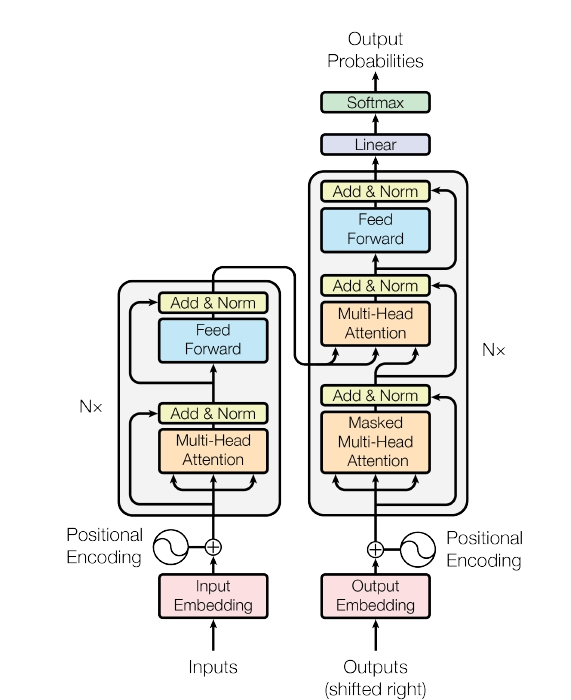
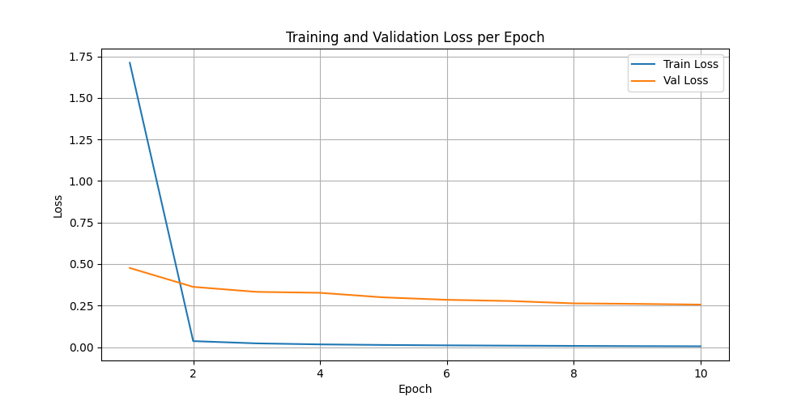
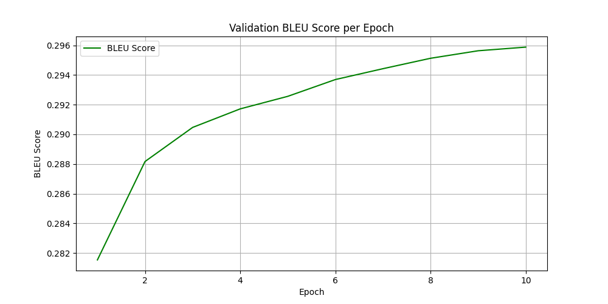

# Transformer Translation Model

This repository contains the implementation of a mini translation Transformer, following the architecture introduced in **“[Attention Is All You Need” — Vaswani et al. (2017)](https://arxiv.org/abs/1706.03762)**. The model was trained on the [DE-En subset of the WMT17 Dataset](https://huggingface.co/datasets/wmt/wmt17/viewer/de-en).
## Project Structure

```
├── .gitignore
├── README.md
├── requirements.txt
├── transformer_architecture.jpg
├── src
│   ├── attention.py      # Attention + MultiHeadAttention implementation
│   ├── data.py           # Tokenization and dataset loading
│   ├── model.py          # Transformer architecture
│   ├── train.py          # Training script with CLI
│   ├── util.py           # Util functions for simplicity
├── tests
│   ├── test_attention.py
│   ├── test_mha.py
└── outputs
    └── plots             # Visualizations during training
        ├── loss_plot.png
        └── bleu_plot.png


```

## Full Transformer Encoder–Decoder Architecture

Implements the architectural elements from the original paper:

* Positional encodings
* Multi-head self-attention
* Cross-attention
* Feed-forward networks
* Residual connections + LayerNorm
* Masking for autoregressive decoding


## Training Pipeline

Includes:

* WMT17 DE→EN via Hugging Face Datasets
* Tokenization using `AutoTokenizer` from Hugging Face
* BLEU score evaluation
* Automatic saving of checkpoints & plots

## Installation

```bash
pip install -r requirements.txt
```

## Running Tests

Run unit tests for the custom attention components:

### Scaled Dot-Product Attention

```bash
pytest tests/test_attention.py -q
```

### Multi-Head Attention

```bash
pytest tests/test_mha.py -q
```

## Training

```bash
python3 src/train.py \
    --output_dir outputs \
    --batch_size 32 \
    --epochs 10 \
    --subset_train 70000 \
    --subset_val 7000 \
    --model_dim 512 \
    --num_heads 8 \
    --enc_layers 6 \
    --dec_layers 6
```
* Subsets are used to keep computations manageable.
* The configuration is comparable to a reduced Transformer-base model.
* After training `outputs/` include:

  * `outputs/plots/` - Visualizations during training
  * `outputs/model/` - Saved model

## Visualizations

### Loss Curve



### BLEU Curve



### Weights & Biases Tracking

All training runs, metrics, and plots are available on the Weights & Biases (wandb) project page available via this [link](https://wandb.ai/matyashpr/interview_task?nw=nwusermatyashpr).  
You can explore detailed analytics such as loss curves, BLEU score plot, and system logs for full transparency and reproducibility.

### Training Analytics

The analysis of the attached visualizations shows:

- Smoothly decreasing loss on both the training and validation sets, suggesting:
  - no signs of overfitting
  - stable and meaningful gradient updates
  - successful learning throughout training
- Consistently increasing BLEU score on the validation set across epochs (from 0.2815 to 0.2959), indicating that the model was steadily improving its ability to generate fluent and accurate translations, taking into consideration its parameters and the size of the training set.

Overall, the metrics confirm that the model was learning effectively, updating its weights correctly, and generalizing well to unseen validation data.

## Environment
Tested on MacOS15.7.2 and Ubuntu22.10

Python version Python 3.10.12
## Contact

matyashpr@gmail.com

Daria Matiash
